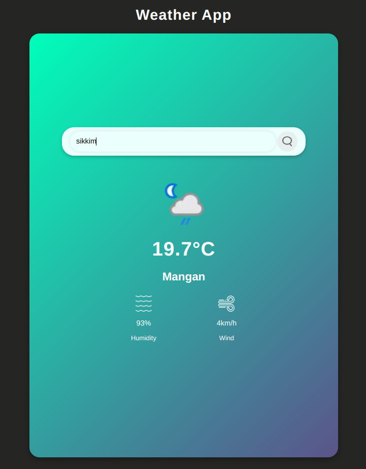

# Weather App

This is a simple Weather App built with HTML, CSS, and JavaScript. It fetches current weather data for a specific city using the [WeatherAPI](https://www.weatherapi.com/) and displays it on the web page.

## Features

- Get current weather information for a specific city.
- Display the current temperature, humidity, and wind speed.
- User-friendly interface with a responsive design.
- Error handling for incorrect API requests.

## Screenshot



## Technologies Used

- HTML
- CSS
- JavaScript
- Api

## Setup and Installation

1. Clone the repository:

   ```bash
   git clone https://github.com/your-username/weather-app.git
